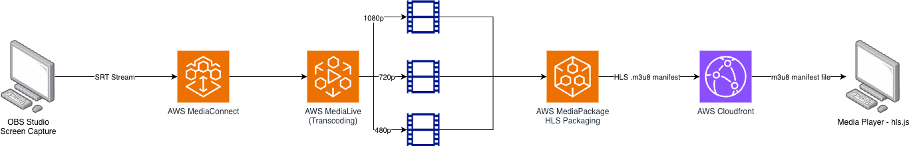

# Thmanyah Live Streaming Pipeline

This repository contains a Terraform-based live streaming pipeline on AWS.

## Architecture Diagram

## Documentation

- PDF: [Live-Streaming-Pipline-Documentation.pdf](Live-Streaming-Pipline-Documentation.pdf)

## Demo Video

- YouTube: [Project Demo](https://www.youtube.com/watch?v=sgwHCokzAyg)

## Repository Contents

- `terraform/`: Infrastructure code for MediaConnect, MediaLive, MediaPackage, CloudFront, and IAM
- `web-player/`: Simple HLS player (`index.html`)

## Prerequisites

- Terraform 1.5+
- AWS CLI v2
- OBS Studio
- AWS account with permissions for Media services, IAM, CloudFormation, and CloudFront

Set up AWS credentials:

- Run `aws configure`
- Use region `us-east-1`

## Setup

From the project root:

- `cd terraform`
- `terraform init`
- `terraform validate`
- `terraform plan`

## Deploy

- `cd terraform`
- `terraform apply`

After deployment, use these outputs:

- `srt_ingest_endpoint` for OBS stream server
- `hls_playback_url` for browser playback

## Stream Test

1. Open OBS Studio.
2. Go to `Settings > Stream`.
3. Set `Service` to `Custom`.
4. Set `Server` to the `srt_ingest_endpoint` output.
5. Start streaming in OBS.
6. Open `web-player/index.html` in a browser.
7. Paste `hls_playback_url` and play.

## Destroy Resources

Media services continue billing while running.

- `cd terraform`
- `terraform destroy -auto-approve`

## Notes

- MediaConnect flow and MediaPackage endpoint are provisioned through CloudFormation stacks from Terraform.
- If playback fails, check that MediaConnect is `ACTIVE` and MediaLive channel is `RUNNING`.
